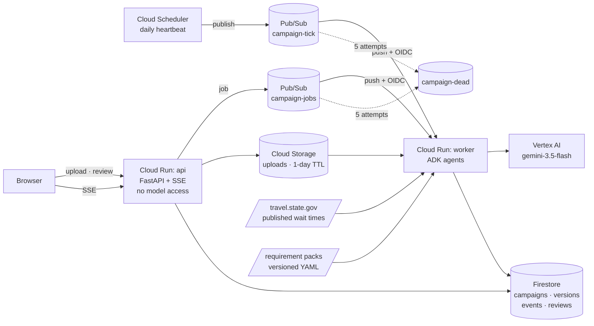

# Taashira · تأشيرة

**An agent that runs a student-visa campaign for applicants whose own identity documents
expire inside the plan.**

Built for the [All Things Agentic Hackathon](https://allthingsagentichackathon.devpost.com/)
— Taskmaster track.

Live: https://taashira-api-871622321683.us-central1.run.app

---

## The problem

A visa application is usually modelled as a checklist. For most applicants that is close
enough. For an applicant holding a **travel document rather than a passport**, it is wrong
in a way that costs an academic year.

A Lebanese travel document for Palestinian refugees is valid for **five years with an UNRWA
vitality card, and one or three years without one**. A visa is never issued beyond the
validity of the document it is placed in. So a two-year masters programme can outlast the
document it depends on — and the renewal is not a prerequisite sitting outside the plan,
it is a **node inside the dependency graph**, with inputs of its own.

Those inputs have their own rules. The renewal needs an Individual Civil Extract **issued
within the last three years**, so an extract that was fine last year can go stale
mid-campaign and block the renewal that the visa depends on.

That is three levels of cascade before anyone has filled in a form. And the forms
themselves assume facts the applicant does not have: nationality fields, and the
214(b) presumption of immigrant intent rebutted by "ties to your home country", for
someone with no home state.

**This is not a checklist. It is a scheduling problem with temporal constraints.**

## What Taashira does

It models a campaign as a **dependency graph of documents with validity windows, scheduled
backwards from an immovable date** — the semester start. Then it runs in the background,
re-evaluates every day, and repairs the plan when a constraint breaks.

Given a stateless applicant with a one-year travel document and a two-year programme, it:

1. detects that the travel document cannot cover the programme, and **splices a renewal
   into the graph**;
2. detects that the renewal's own civil extract will be stale by the time it is used, and
   **splices a re-issue below that**;
3. reschedules everything downstream and reports that the January intake is
   **24 days infeasible**, naming the node responsible rather than saying "not enough time";
4. has an adversarial consular agent argue for refusal, citing only rules that exist in the
   loaded requirement pack.

Given the *same pack* and an applicant with an ordinary ten-year passport, it produces nine
nodes and no remediation at all. The cascade is a function of the applicant's documents,
not a hardcoded storyline.

## How a campaign runs

1. **Intake.** A short conversation establishes the corridor, the programme dates and the
   applicant's status, and emits a typed `CampaignSpec`. The chat is the door, not the
   product — everything downstream consumes typed state, never the transcript.
2. **Documents.** The applicant photographs their papers. `DocumentExtractor` reads dates,
   converts DD/MM/YYYY, refuses to guess an ambiguous one, and redacts document numbers to
   the last four characters. Extraction updates the dossier, which **re-plans immediately**.
3. **Planning.** The deterministic planner splices remediation subgraphs for every broken
   constraint and reschedules everything downstream.
4. **Adversarial review.** `ConsularCritic` argues for refusal; `CampaignCoach` turns that
   into prioritised next actions. Both are filtered against the pack before display.
5. **Background.** Cloud Scheduler wakes the worker daily. It refreshes published consular
   wait times, re-plans every active campaign, and raises events **only when the plan
   actually changed**.

## Architecture



### Two services, split by capability

| Service | Identity | Roles | Can call a model? |
|---|---|---|---|
| `taashira-api` | `taashira-api@` | `datastore.user`, `pubsub.publisher` | **No.** No `aiplatform.user` binding exists. |
| `taashira-worker` | `taashira-worker@` | + `pubsub.subscriber`, `aiplatform.user` | Yes — the only identity that can. |

The public surface physically cannot reach Vertex AI. That is enforced by IAM, not by
convention, so compromising the browser-facing service cannot spend on inference.

That constraint shapes the architecture rather than being bolted onto it: because the API
cannot run an agent, uploading a document or asking for a review **publishes a job** and the
worker picks it up. The security boundary and the asynchronous design are the same decision,
which is why those operations are genuinely backgrounded rather than a synchronous call
dressed up as one.

### The split that matters most

**The model never does arithmetic.** Constraint evaluation, backward scheduling, critical
path and feasibility are deterministic Python with unit tests. The model extracts facts from
documents and argues about evidence — jobs where judgement is the point. Dates are jobs where
being plausibly wrong is catastrophic.

### Agent topology — 4 LLM agents, and two things deliberately left out

```
DocumentExtractor   LlmAgent · multimodal · output_schema=ExtractedDocument
IntakeAgent         LlmAgent · output_schema=CampaignSpec
ConsularCritic      LlmAgent · output_schema=RefusalFindings      ← adversarial
CampaignCoach       LlmAgent · output_schema=CoachPlan
```

**Scheduling is not an agent.** Constraint evaluation, backward scheduling, critical path
and feasibility are ordinary Python in `taashira/planner/`, unit-tested. A model that is
plausibly wrong about a date costs an academic year, and you cannot unit-test a prompt the
way you can test arithmetic.

**Routing is not an agent.** Which agent runs is decided by a Pub/Sub job kind, not by a
model choosing. A deterministic router cannot hallucinate a step, cannot loop, and fails
into a dead-letter queue you can inspect.

The agents are also not chained to each other. A deterministic grounding filter sits between
the critic and the coach, so a finding citing an invented regulation is discarded before it
can become advice. Chaining them through session state would be fewer lines and would let a
fabricated rule propagate.

### Failure tolerance

- **Hallucination is filtered, not trusted.** Every critic finding and every coach action
  must cite an `authority` string that exists in the loaded pack, verbatim. Anything else is
  discarded and counted — `grounding_rate` is a measured property, not a claim. Live runs
  against `gemini-3.5-flash` ground at 100%, and the filter is unit-tested against
  deliberately fabricated citations.
- **Every agent has an `output_schema`.** Unparseable output raises `AgentOutputInvalid`
  rather than being accepted as a string.
- **Unknown beats guessing, in the model too.** The extractor is instructed to return null
  and name the field in `unreadable_fields` rather than infer an ambiguous date. Any
  unreadable field, or confidence below 0.75, routes the document to human review.
- **Unknown is not pass.** Constraint evaluation is tri-state. A document with no recorded
  expiry routes its node to `needs_human_review` rather than quietly succeeding — the exact
  failure that loses a visa.
- **Redelivery cannot double-act.** Events and actions are keyed on
  `(campaign_id, version, kind, detail)` and written with Firestore `create`, so at-least-once
  delivery is deduplicated atomically.
- **Poison messages dead-letter** after 5 attempts instead of retrying forever.

## Published wait times, not scraped portals

`interview_appointment` declares a signal:

```yaml
    wait_time_signal:
      post: Beirut
      visa_class: student
```

The worker reads the wait time the State Department **publishes** for that post and lets it
supersede the pack's estimate. When the queue lengthens, every downstream date moves and the
plan can go from feasible to infeasible with nobody present.

Two sources, in that order: a live read of the published page, and a committed snapshot
carrying the date it was taken. If the live read fails or the page layout changes, the system
falls back **and reports which source it used**. It never invents a number, because a
fabricated wait time would silently move every date in a months-long plan.

This is reading a published figure. Taashira does not touch the appointment system.

## Requirement packs are data, not code

A corridor is one `(document held → destination + visa type)` route, and each one is a
versioned YAML file in [`packs/`](packs/). Adding a corridor is authoring a file.

Each requirement carries lead times, dependencies, temporal constraints, and an `authority`
citation. Referential integrity is enforced at parse time.

```yaml
- id: visa_interview
  authority: "US Dept of State: visa validity may not exceed the validity of the travel document"
  constraints:
    - kind: covers
      document: travel_document
      period: program
      remediation: renew_travel_document   # ← this one field is the cascade
```

Five constraint kinds: `valid_at`, `covers`, `max_age_at_use`, `min_seasoning`,
`not_before` / `not_after`.

**Lead times are estimates and the packs say so.** Fee amounts and validity rules are cited;
day counts are planning heuristics used to compute risk.

## Spin up from scratch

Prerequisites: Python 3.12+, the `gcloud` CLI, and a Google Cloud project with billing.

```bash
git clone <this repo> && cd Taashira-AI
python3 -m venv .venv && .venv/bin/pip install -e ".[dev,agents]"

# Everything below runs with no cloud account at all:
.venv/bin/python -m pytest -q                      # 28 tests
TAASHIRA_USE_FIRESTORE=0 .venv/bin/uvicorn taashira.main:app --reload
# open http://localhost:8000
```

To deploy:

```bash
./scripts/setup-gcp.sh   <PROJECT_ID>   # APIs, Firestore, Pub/Sub topics, service accounts
./scripts/deploy.sh      <PROJECT_ID>   # build and deploy the API
./scripts/setup-async.sh <PROJECT_ID>   # Scheduler → Pub/Sub → worker push
```

See [`docs/deployment.md`](docs/deployment.md) for the live configuration and for three
Cloud Run gotchas that cost us time.

## Verifying it works

```bash
.venv/bin/python -m pytest -q
```

The planner tests are the real safety net. They assert the cascade fires at two levels, that
the control applicant produces none from the same pack, that an unknown expiry routes to human
review rather than passing, and that renewing the document heals the plan and removes the
remediation nodes.

End to end against the deployment:

```bash
gcloud scheduler jobs run taashira-daily-tick --location us-central1 --project <PROJECT_ID>
gcloud logging read 'resource.labels.service_name="taashira-worker"' --limit 20
```

## What is real and what is synthetic

Stated plainly, because overstating what runs is a scoring failure:

- **Real:** the planner and its cascade; the constraint engine; both Cloud Run services;
  Firestore state and version history; the Pub/Sub tick and job loops with their dead-letter
  queue; the Cloud Scheduler heartbeat; document extraction, the adversarial critic and the
  coach — all four agents run against `gemini-3.5-flash` on Vertex AI, and every agent output
  quoted in this file is real output, not an illustration.
- **Synthetic:** the applicant and their documents. Everything in
  [`taashira/fixtures.py`](taashira/fixtures.py) is fabricated, and the document images in
  `data/synthetic/` are generated by [`scripts/make_synthetic_docs.py`](scripts/make_synthetic_docs.py)
  and stamped "SPECIMEN — NOT A REAL DOCUMENT". No real identity document, number, or
  personal record appears anywhere in this repository.
- **Estimated:** the lead times in the requirement packs, except where a published wait time
  supersedes them. The packs say so in a header comment, and the UI shows the pack estimate
  next to the observed figure.
- **Never touched:** government and embassy portals. Taashira does not book appointments, does
  not submit applications, and does not automate any consular system. It assembles, schedules,
  argues, and warns. Every submission is made by a human.

## Stack

| Requirement | Used |
|---|---|
| Gemini 3.5 or newer | `gemini-3.5-flash` on Vertex AI (`global` endpoint) |
| Google agent framework | Google ADK 2.8 — `LlmAgent` with structured `output_schema`, multimodal input via `InMemoryRunner` |
| Google Cloud services | Cloud Run, Firestore, Pub/Sub, Cloud Scheduler, Cloud Build, Artifact Registry |

Python 3.12, Pydantic v2, FastAPI.

## Origin

The builder holds a travel document for Palestinian refugees issued by Lebanon. He obtained a
J-1 with the US Department of State sponsoring him, and it was smooth — an institution absorbed
the friction on his behalf. The masters application has nobody behind it, and the travel
document expires before the degree would end.

The friction here is **structural, not biographical**: it belongs to every refugee travel
document, every short-validity passport, and every applicant whose form has no correct answer
in the nationality field.
